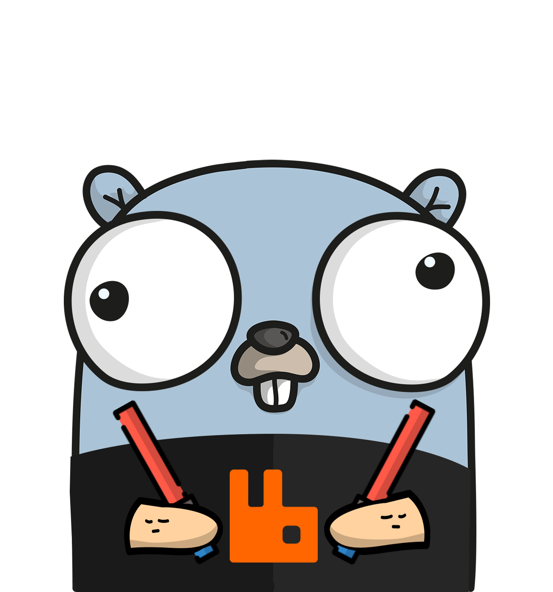

# Rabbit-hpa
[](http://hits.dwyl.io/idobry/Rabbit-hpa) [](https://github.com/dwyl/esta/issues)



Rabbit-hpa is a service for auto scaling kubernetes pods based on messages count in Rabbit's queues.

### Prerequisites

* Kubernetes cluster
* Rabbitmq and RabbitmqManagment
* Go 1.9 or later

### Installing

```
git clone https://github.com/idobry/Rabbit-hpa.git .

GOOS=linux go build -o ./rabbit-hpa .

docker build .
```

### Deployment

Rabbit-hpa was built to run inside a kubernetes cluster.

```
kubectl apply -f ./kubernetes
```

## Contributing

Code contributions are very welcome. If you are interested in helping make chartmuseumui great then feel free!

## Versioning

We use [SemVer](http://semver.org/) for versioning.

## Authors

* **Ido Braunstain** - *Initial work*

See also the list of [contributors](https://github.com/your/project/contributors) who participated in this project.
